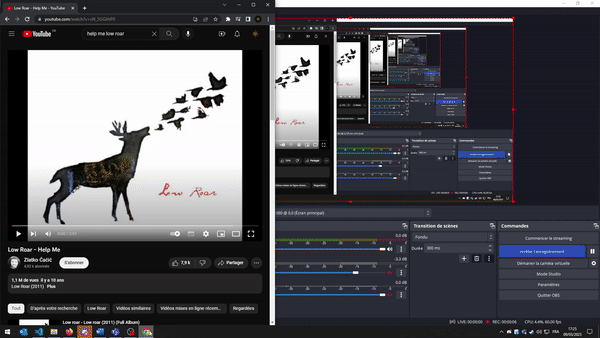

# Youtube-Downloader

This is a Python console program designed to retrieve and **download** Youtube audio & videos from any public link. It can download either from single **videos**, or **playlist**. It also adds metadata like the **title**, the **thumbnail** and the **author**.

## Installation

1. Retrieve the project repository.
2. You may need to export the ffmpeg binary either in your PATH or the current folder.
3. Install the project requirements (in a virtual environnement if you prefer) `pip install -r requirements`.
4. You are good to go! Just run `python main.py` to launch the program.

## Usage
```
░█░█░█▀█░█░█░▀█▀░█░█░█▀▄░█▀▀░░░█▀▄░█▀█░█░█░█▀█░█░░░█▀█░█▀█░█▀▄░█▀▀░█▀▄
░░█░░█░█░█░█░░█░░█░█░█▀▄░█▀▀░░░█░█░█░█░█▄█░█░█░█░░░█░█░█▀█░█░█░█▀▀░█▀▄
░░▀░░▀▀▀░▀▀▀░░▀░░▀▀▀░▀▀░░▀▀▀░░░▀▀░░▀▀▀░▀░▀░▀░▀░▀▀▀░▀▀▀░▀░▀░▀▀░░▀▀▀░▀░▀
                                                            by Valenwe


1. Enter URL [current: None]
2. Download audio from URL
3. Download video from URL
4. Automatically get best quality [current: True]
5. Set folder [current: C:\Users\Downloads]
6. Exit
```



- There is the possibility to add some verbosity over the ffmpeg commands by using `-v` parameter while running `main.py`.

## Insight

- The program is self efficient and does not depend on any Google API, or known Youtube Python module like **youtube-dl** or **pytube**. Though I used some code from **pytube** for Playlist listing, most of the code is using low level modules like `requests` or `urllib` to retrieve information and data.
- All the audio and video encoding is done via FFMPEG (a usable Windows binary is in the repository).
